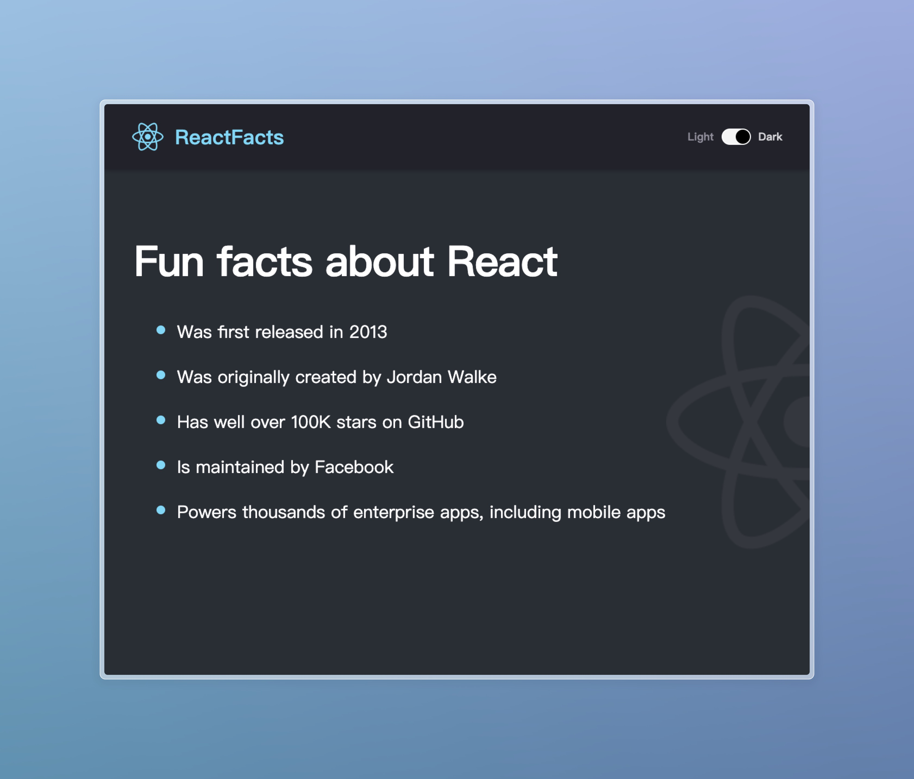
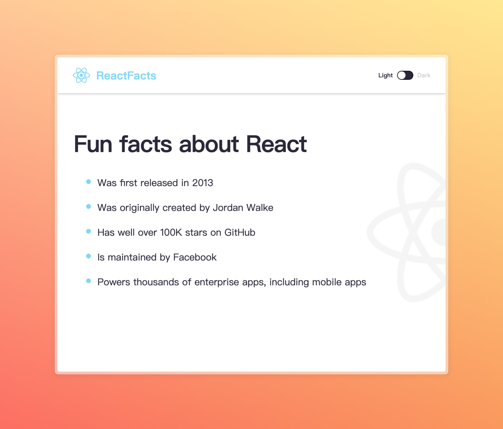

# Project Title

This is a simple React application that includes a Navbar and a Main component. It also has a dark mode feature that can be toggled on and off.

## Getting Started

These instructions will get you a copy of the project up and running on your local machine for development and testing purposes.

### Prerequisites

What things you need to install the software and how to install them:

- Node.js
- npm

### Showcase

#### Dark Mode:

#### Light Mode:
